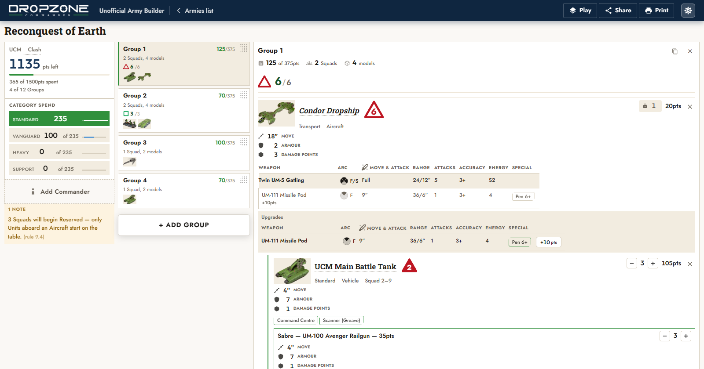

<div align="center">

[](https://type37.github.io/dropzone-3e-army-builder/)

# Dropzone Commander 3E Army Builder

### [Open it](https://type37.github.io/dropzone-3e-army-builder/)

</div>

Assemble and print your army in this unofficial army builder for [Dropzone Commander](https://www.ttcombat.com/games/dropzone-commander), published by TTCombat. This web app was designed by WarLore.

## What it does

- Six factions, every unit, third edition, plus the Behemoths.
- Enforces the rules while you build rather than grading you after: points, category spend, Group composition, transport capacity, Commander levels — down to Shaltari Gates and unarmed Subterranean Units costing no Group, and a Transport Behemoth's cargo costing one of its own.
- Squads nest under the Transport carrying them, because that is how a Group works.
- Print sheets, play mode, share by link or plain text, backup and restore, works offline, no account.
- Rules quoted from TTCombat's own PDFs. Six audit scripts run on every ingest, two of which open the PDFs and check that every word printed on a card reached the data.

## Design decisions

- Dresses as its own rulebook: warm paper, navy rail, gold Deco, Fluent 2 underneath. Tighter than the Dropfleet builder it forked from.
- One responsive app, not two builds. Dropfleet ships a separate `/mobile/`; this is the correction.
- Mobile first, because the phone is the one used at a table.
- Every panel is square. Buttons may have a radius; a card may not.

## Still to do

- The Squad card is too tall. A 4-Variant unit draws four weapon blocks, three of which you usually do not own. Collapsing untaken Variants means hiding gameplay text, so it needs a deliberate call.
- Big Squads need a size control that carries ranges like 3–9 and 6–12.
- Whether an Aux Gate may be taken with a Squad aboard. Its rule says it uses a Gate's rules "except they are taken as non-Gate Squads", and a Gate is "not taken with any Units aboard" — which of those wins is a reading, not a bug. The app currently allows it.
- A Transport Behemoth's cargo is counted as its own Group but still drawn inside the Behemoth's, because `carriedBy` is what draws the nesting tree.

## Run it

```bash
python -m http.server 8899
```

Tests, and the data pipeline that rebuilds everything from the PDFs:

```bash
node scripts/test-all.mjs      # 1680 assertions
python tools/dzc/rebuild.py    # PDFs -> data/dzc/, then six audits
```

## Legal

Game data, rules text, unit names and art are TTCombat's. Unofficial, not endorsed by TTCombat.

[Report a bug](https://github.com/Type37/dropzone-3e-army-builder/issues/new/choose) · [Dropfleet builder](https://type37.github.io/dropfleet-builder/) · [WarLore](https://jetwong.neocities.org/)
